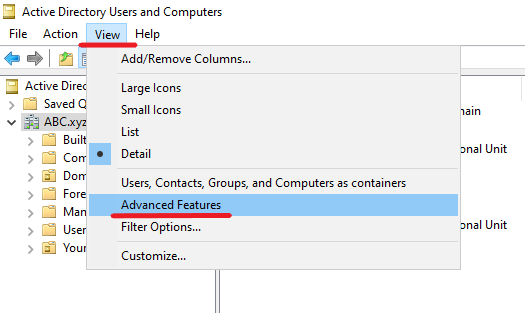
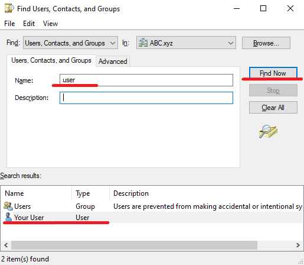

# How to search for a user's location within Active Directory Using Active Directory Users and Computers and PowerShell
To search for a user’s location within Active Directory, you can use tools like Active Directory Users and Computers (ADUC) or PowerShell.
## Using Active Directory Users and Computers (ADUC)
First, open ADUC. To do this, go to Start ➝ Administrative Tools ➝ Active Directory Users and Computers. Then navigate to the View menu and select Advanced Features.

After that use the search function to find the user – make a right-click on the domain or the appropriate container, select Find, enter the username in the search field and click Find Now.

Continued on the [iolloi.icu](https://iolloi.icu/index.php/2024/07/30/how-to-search-for-a-users-location-within-active-directory/)
